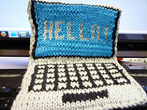

#First Things First {-}
Taught by Shawn Graham, this course introduces method and theory for digital history. This site acts as the course handbook and syllabus. READ EVERYTHING. 

The workbook may be found at the [workbook site](http://workbook.craftingdigitalhistory.ca). Contact info for Dr. Graham is [here](contact-details.html). 

How do we find, analyze, and visualize the patterns in historical data? Is the internet a historical source? How do people talk about history online? Is Google changing our historical consciousness? What happens when people off-load their historical memory to Wikipedia? How do we regain control over our digital identity as historians? What does open access research mean for me? What happens when digital memory is under assault?

Through a series of skill-building exercises and collaborative work, we will build our way towards some answers.

Oh, that tool bar on the right of the screen? That lets you annotate this site with questions and observations (it's called 'Hypothes.is'). The idea with this tool is that as you read the syllabus, you can annotate those parts that excite you, or puzzle you - and see where others are interested as well. Respond to others' posts. You'll need to create a userid and login for Hypothes.is. More on this further on in this manual.  

Across the top of the screen are buttons that allow you to change the site theme, to ease readability; also, there are download buttons for a PDF and Epub version of this manual, for printing out or reading offline if you desire. Finally, there is an edit button that allows you (once you have a [Github](http://github.com) account) to take a copy of this site for your own remixing.

#tl;dr {-}

Each week, you do exercises designed to teach you the steps of working with digital data in history, and you read articles, examine projects, and study examples of digital history in the wild. You annotate these readings etc, and you keep a 'fail log' and a lab notebook on the exercises. At the end of each week, you submit the links to your annotations, your fail log entries, and your notebook.

I will give you your own domain space (webspace) with which you may do as you please: ideally, this will be where you set up and host your fail log, lab notebook, and other work. Treat this as a serious space on the internet that advertises your abilities as a historian. 

I will give you a dataset which you will explore/analyze with the tools you have learned. This analysis will be written up and made available on the open web as a final project. If your computer is not that powerful or otherwise less-than-optimal, I also have a virtual computing environment which you can use through your browser.

You are **encouraged** to collaborate with one another, but make sure you acknowledge all and any collaboration. The social space for our course will be hosted on Slack (Slack.com). All necessary logins, passwords, and other getting-started parphernalia will be provided to you in the first week of class.

Grading is based on the satisfactory completion of **all** exercises. Grading takes into account your starting point versus your finishing point. That is to say, I take into account your *progression* as a digital historian. Thus, the actual work that constitutes an 'A' for one student could look quite different for another student. You are thus in control of your own destiny in the course. You do not need to be techy. That will come.

The talk below was given to a group of 30 professional academics, archaeologists, and heritage professionals. It will give you a good idea of what I am like, and where I am coming from in terms of my expectations for digital work from students. Fast forward to 4.06m to start.

<iframe width="560" height="315" src="https://www.youtube.com/embed/Lo_QQl22Uhg" frameborder="0" allowfullscreen></iframe>

NOW READ ON...

#Course Philosophy 

Increasingly, numerous historical documents making massive amounts of data are being put online. But, once that material is online, we face a question of ‘so what?’ This course will give you the digital research and data management skills and reflexive theoretical grounding to answer the ‘so what’. As digital historian Adam Crymble writes, ‘We’ve spent millions digitizing the world’s historical resources. Let’s work together to figure out what they can teach us’.

<iframe src="https://www.youtube.com/embed/-sAuoRQgBh0" width="560" height="315" frameborder="0" allowfullscreen=""></iframe>

This course is about crafting digital history, about data mining documents, about reading distantly thousands of documents at once, about graphing/mapping/visualizing what we find, and working out how to best communicate those findings. It is about writing history in digital media, which are primarily visual media. Thus, we will learn how to scrape data, how to find meaningful patterns within it, and how to visualize (via websites or infographics) those results. Readings will be from relevant literature in the field (mostly open access).

Things will go wrong. Stuff will break. You will be frustrated. This will not be easy, but it will be rewarding if you stick it out.

You won't have taken a course like this before.

## What do you need to succeed?
This course is not easy. It has no multiple choice tests, no assignments that you can crib via a google search. Rather, it expects you to take responsibility for your own learning, and for you to make a convincing argument showing how you’ve changed as a historian. It requires you to be

- self-directed;
- motivated;
- self-disciplined;
- able to admit to yourself and to others when things aren’t going according to plan;
- able to collaborate with others in a transparent manner, giving credit where credit is due;
- committed to working through in public the problems and potentials of digital history;

If this sounds like you, or someone you are willing to become, then you will be ok. Now that you’ve got this far, please make sure to complete the ‘[pre class questionnaire](/questionnaire)’. Now, read on...

## On Craftiness

Great art comes from inspiration. Technical skill, yes of course. But 'inspiration' - the divine breath. Science? Science requires hard work and graft. Careful observation, attention to detail, replication, routine and method. Carefully record everything, and someone else could (should be able to) replicate it. Yes, there is insight and eureka moments, but we can agree that art and science are at different points along the continuum. So what of craft? I know a man who is astonishingly good at wood working. He will stand there, quietly, while he contemplates a piece of wood. Then, without a word, he begins to work with it. He sees the grain, and can feel how the piece is going to go. The materials can be guided, but they push him as much as he pushes them. The resulting piece can be typed - 'Oh, you make a shaker-style chair' - but, in its own quiet way, it is unique.

To my mind, digital history sits in the realm of craft. Maybe digital history is at the midway point on the continuum between art and science. Or maybe 'craftiness' is just another axis, and there are a landscape of possible configurations in the x,y,z space of art/science/craft. In any event, there is no recipe I can give you that will enable you to 'do' digital history. Sure, I can show you how to topic model, and you can run data through it like grist through a mill, but that's not to say that the result is meaningful. The craft of digital history lies in knowing *which* techniques work best with *what* materials - and in knowing when to go against the grain. It lies in producing sometimes beautiful unique pieces that bring out a greater truth, that stand on their own. At other times, it involves quietly producing the one piece that fits perfectly into the larger argument.

My own practice lately has been blurring between visualization/sonification and sound art. I'm hoping that over the course of this term, you will find your own crafty corner of digital history to call your own. It will change with time, practice, and exposure to digital media and ways of representing the past. What was hard becomes easier (and at the same time, less examined at a theoretical level), the goal posts move, and the latest digital toy appears on the horizon. But you will be equipped to evaluate, incorporate, ignore, as needs arise.

## A question to start with: do I need to be techy?

You do not need to be ‘techy’ to succeed in this course. I know that digital skills come in all shapes and sizes - I grade how far you've *come*, not where you **get to**. What is far more important than being 'techy' is that you are willing to try, and willing to say ‘I don’t know – help?’ I expect you to talk to each other in this class. Share your work. Collaborate. Help each other!

I sometimes talk about 'failing in public'. That is to say, we talk about and critically examine the things that work, and the things that didn't. 'Fail' in this context doesn't mean the end of the road: rather it's just one stage in a productive cycle of learning, experimenting, and community building that makes digital history one of the most exciting fields to work in.

## The characteristics of a Digital historian

Caleb McDaniel, of Rice University, writes that a good historian exhibits skill and nuance in five specific ways (from his [HIST118 Rubric](http://wcm1.web.rice.edu/pdf/rubric.pdf)):

1. Narrativity - they identify and tell the important story, with full regard for its complexity (and issues of change and continuity and causality)
2. Evidence - they marshall appropriate evidence to support the story, and understand its strengths and limitations, using the full critical apparatus available to historians
3. Empathy - they write with care and consideration for these lives in the past. That is to say, they recognize the 'why' of what happens without retrojecting current mores onto actors in the past
4. Style - they write with verve and fluidity, grace, clarity and cohesiveness
5. Self-reflection - they acknowledge and examine their own perspective vis-a-vis the past and understand (or try to understand) how that is having an impact on the story told.

All historians - all _good_ historians - score well on that rubric. Digital Historians have a few more characteristics that emerge out of our engagement with the digital. Remember, the digital is not a passive place, but is rather dynamic, and emergent at the intersection of both human and non-human actors. We have to be cognizant of the _sociology_ of digital production, and the ways that -for instance- the heavily white male demographic that _encodes_ the tools and platforms make hidden value judgements about what is important. Thus, the characteristics of a good digital historian, in addition to McDaniel's points, must also:

1. Value 'fail' - identifying the ways tech and humans 'fail' and how we react to these 'fails' is a critical issue
2. Reproducibility - digital history, unlike 'regular' history, is in principle reproducible. How do we deal with this?
3. Collegiality - good digital history **can not** be done in isolation. How do historians learn to play nice with one another?
4. Evidence - in addition to the usual questions of historical evidence, the digital historian has to consider how her evidence has come to be digitized. This means understanding not just the technological aspects, but the sociological aspects of knowledge production, software creation, surveillance capitalism, and more.
5. Self-reflection - added to MccDaniel's ideas about self-reflection, the digital historian enjoys a Red-Queen relationship with technology: they have to run faster and faster just to stay in the same place. Technology changes rapidly. Being reflective about digital technology also means reflecting on what one knows and what one does not, and taking active steps to identify and learn whatever technology (and supporting theory) required by the historical question. Thus, the digital historian also engages with current debates about technology's role in the world through their practice.

The lessons, exercises, and activities in this course are all mapped against these characteristics of being a good digital historian.