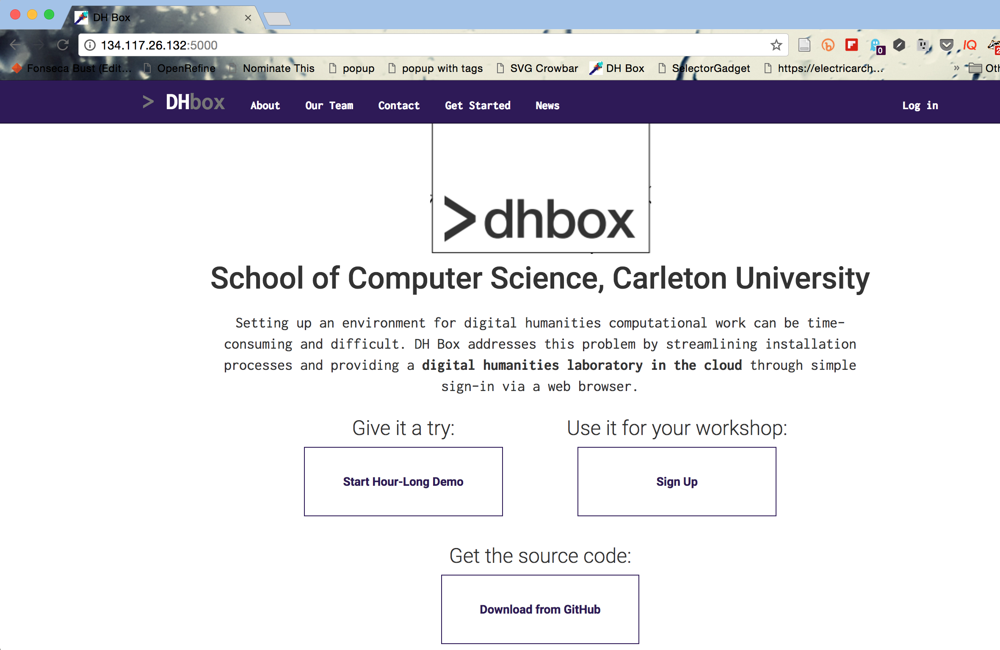
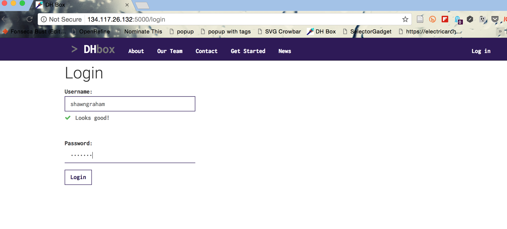
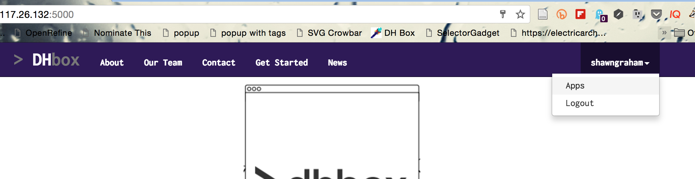
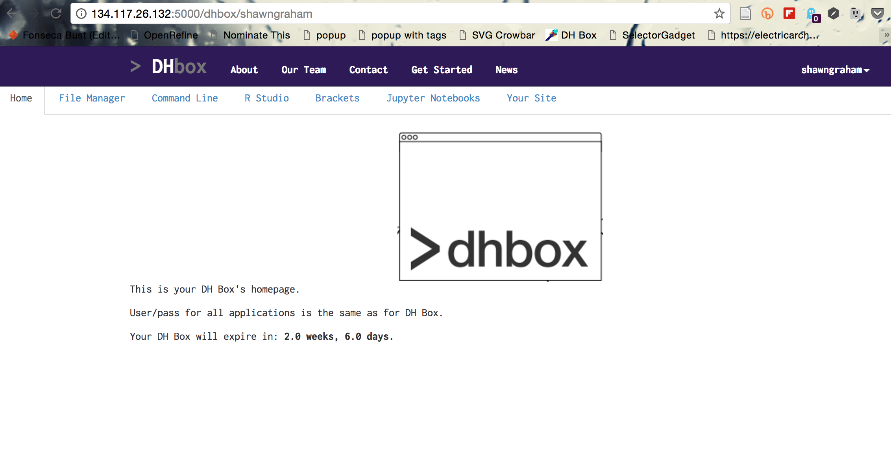

# Setting up your machine

The [workbook, 'getting yourself ready'](http://workbook.craftingdigitalhistory.ca/introduction/crafting-digital-history/#getting-yourself-ready-july-4th-9th) contains detailed instructions on how to get your workspace set up. You will begin your course work in that section.

Since you all are coming to this class with differing levels of digital literacy, different computers, and different operating systems, I have standardised things by putting together a virtual computer for you called 'DHBox' ('digital humanities box'). 

You access it through your webbrowser, at [this location](http://134.117.26.132:5000/). The chrome browser works best with our DHBox. **If you are not on campus, you must [Carleton's VPN service](https://carleton.ca/its/help-centre/page-type/vpn/) to log into the DHBox**. The link will **not** work unless you are either on campus or connected to campus via the VPN. If you click on the link to our DHBox and nothing happens, you need to follow the link to the Carleton VPN, install the vpn, connect, and _then_ follow the link.

Click on the 'sign up' box.

Select the 4 week option. This creates a DHBox for you that will *persist* for four weeks. Everytime you log back into the DHBox, it will tell you how many days/hours/minutes you have left. When the time is almost set to run out, you can always download your materials, sign up for another four weeks, and re-upload them. The reason there is an expiry date is so that we do not clog up memory and resources on the server that hosts our virtual computer. **Be mindful of the expiry date of your DHBox!**. 

When you come back to your DHBox, click 'login' at the right hand side to log into your DHBox. 

We will be using the 'file manager', the 'command line', and 'R Studio' most often in HSIT3814.

When you click on an app - in the picture below, the command line - DHBox will ask for your username and password again. Enter that information.

## Setting up video & annotation on your local machine
We need to put some things on your machine that will enable me to understand what you are seeing and experiencing as you move through the course, should things not quite click for you.

- [Screen-cast-o-matic](http://screencast-o-matic.com/) allows you to make quick videos. When something doesn't work, you can use this free software to make a video where you can talk me through what you are doing and where things are going wrong
- [Hypothes.is](https://hypothes.is/) This is a plugin for [the Chrome browser](https://www.google.com/chrome/browser/desktop/index.html). Install both Chrome and Hypothes.is. With this plugin, you can highlight text in our [workbook](http://workbook.craftingdigitalhistory.ca) and so on and create an annotation that everyone can see. These annotations can have threaded conversations, so feel free to respond to others' annotations. In your readings, and in the workbook, highlight things that are confusing, or that work well, or that strike you as interesting because of x, y, z. Annotate things that you think might be useful in your other classes, too! More information about Hypothesis is provided in the getting started section of the workbook.

## Setting up a community
Then there is the problem of how do we make this feel like a class, with actual living humans in it, when it's all online?

- A free account for Slack https://slack.com/ which handles our private communications. To sign up for Slack, you will receive via cuLearn a link to a private website into which you will enter your cumail email account. This will give you access to our Slack space. Information on what Slack is and how it works is available [here](https://slack.com/is).
- An account on Github http://github.com; you will set this up on your own.
- Twitter is optional, but most digital humanities / digital history folks are on there, and that’s where a lot of the field is discussed (look up Dan Cohen, the former executive director of the Digital Public Library of America, who maintains an excellent list; a great place to start!) Our course hashtag will be [#hist3814o](https://twitter.com/search?q=hist3814o&src=typd). Use that hashtag on any twitter posts you make related to the course.

## Setting up a digital laboratory
Finally, you will need a kind of 'digital laboratory' or 'workshop' for yourself. This is where your notebook will live (most likely, as a blog, although other platforms can work). I understand this to mean a kind of ecosystem of both offline and online spaces that interconnect, and enable us to work through the potentials of digital history.

-  You will receive a code for a free one-year domain of your own hosted by [Reclaim Hosting](http://reclaimhosting.com). This code will be tied to your official Carleton email account. This webspace is yours to experiment with, but it will also host your own ‘digital history laboratory’. You will set this up on your own, as part of the initial exercises in this class. At the end of the calendar year, you can choose to renew (which costs $US 25) or you can cancel the account.

While you will probably only use this space for hosting a blog and perhaps the exhibition software Omeka, you can also install things like OwnCloud, and set up your very own cloud file-sharing service, for instance. Having your own space, to do with as you wish, means you can install what you want - if you've used cuPortfolio, with Reclaim Hosting you can install the underlying Mahara platform yourself, and keep control over your own copy of those materials for instance.

## Instructions and help

Step by step detailed instructions on getting all of this setup are in the workbook, on the '[Getting Started](http://workbook.craftingdigitalhistory.ca/introduction/crafting-digital-history/)' page. You should begin the course by working through that section, once you've finished going through this course manual.

## Checklist:

Have you:

- set up a hypothesis account?
- installed the hypothesis plugin?
- signed up for a free Github account?
- gained access to Slack?
- obtained a domain of your own from Reclaim Hosting?

ANNOTATE THIS PHRASE with an annotation that shares the link to your Github account and your Domain.